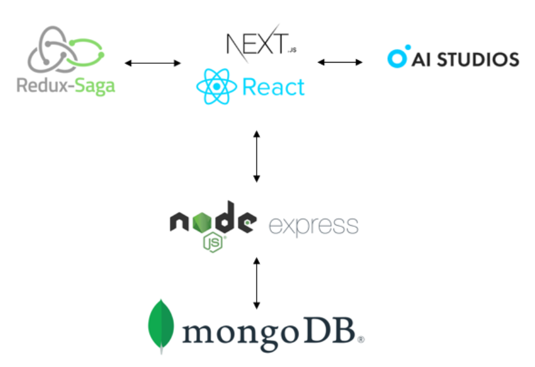
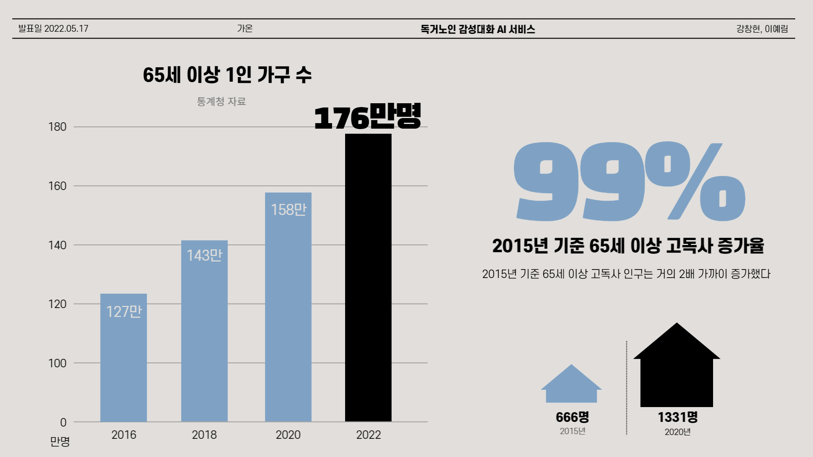
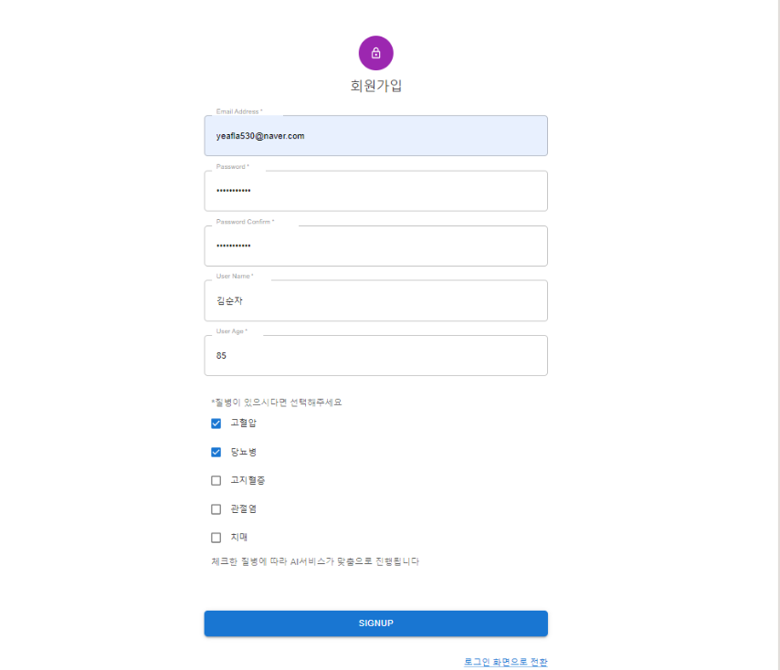
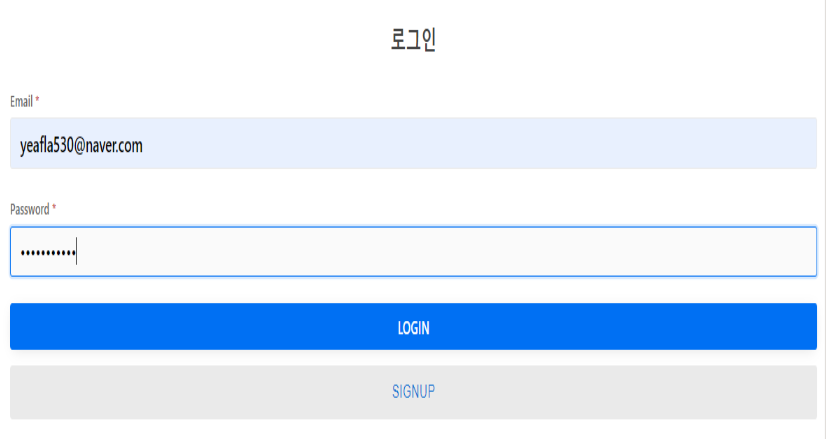
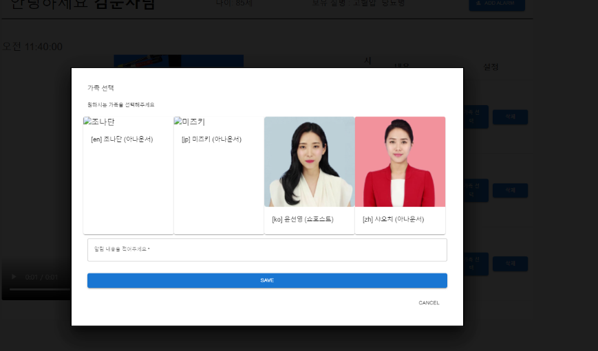
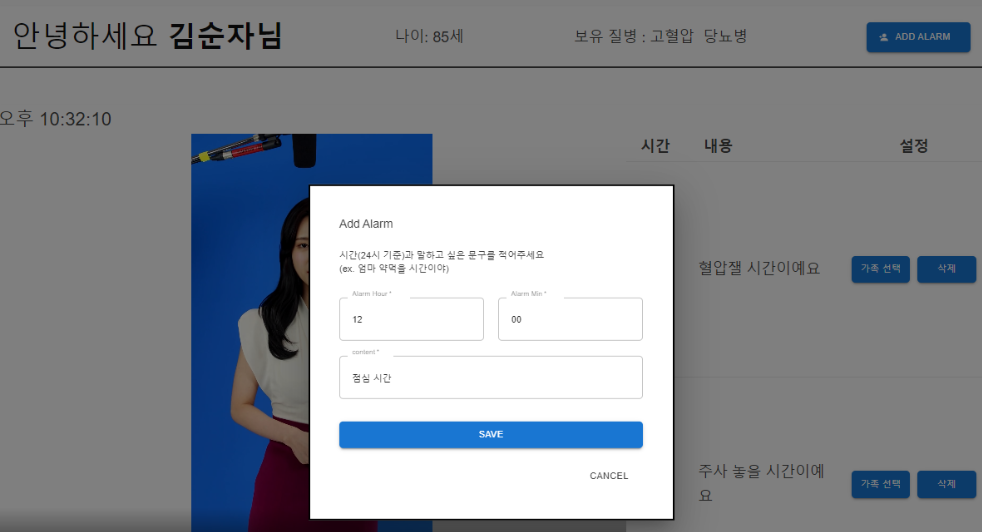
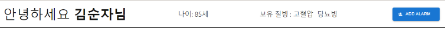

# 독거노인을 위한 감성대화 및 알림 서비스
> 독거노인을 위한 감성대화 및 알림서비스인 가온. 
>
> MVP 방식으로 알람기능을 우선 구현하였습니다. 맞춤형 알림추가와 사용자 알림추가 기능을 제공합니다. 영상에 나올 가족을 선택한 후에 영상의 대화내용을 text로 설정하면, 지정한 시간에 선택한 가족이 설정한 대화내용을 알려줍니다.(Deepbrain AI의 API를 제공받아 진행하였습니다.)


## :hourglass_flowing_sand: Get Started
> if you want to make Local Environment, you have to make `.env.development.local`. complete! play code!

```
// client
$ cd client
$ npm install
$ yarn dev

// client deploy
$ npm run build
$ npm run start

//server
$ cd server
$ npm install
$ npm server.js
```


## 🛠 개발환경

> MERN STACK


> 개발 환경



- Nextjs(ReactJS) / ExpressJS / MongoDB 
- MSA 아키택터를 적용한 MERN stack을 기반으로 진행
- 클라이언트는 react 기반의 nextjs를 사용하였으며, 상태관리는 위해서는 redux toolkit과 Redux-Saga를 활용
- 데이터 통신은 server의 express와 Nextjs에서 제공하는 api를 활용
- AI Studios의 API는 client단의 nextjs에서 서버리스 방식으로 구현


## MongoDB Schema

##### user document
```javascript
const alarmSchema = mongoose.Schema({
    content: {type: String, required: true},
    alerthour: {type: String, required: true},
    alertmin : {type: String, required: true},
    period: String,
    mp4Url: String
})
const userSchema = mongoose.Schema({
    email: {
        type: String,
        required: true,
        unique: 1
    },
    password: {
        type: String,
        required: true,
    },
    name: String,
    age: String,
    feature: [],
    phone: String,
    alarm: [alarmSchema]
}, {timestamps: true});
```


## 🎞기획배경

저희는 사회 이슈를 해결하는 방향으로 프로젝트를 기획하기로 하였고, 독거노인의 증가로 인한 사회 이슈를 주제로 프로젝트를 기획하게 되었습니다.

현재 65세 이상 1인 가구수는 2016년에 대비해 49만명이 증가하였고, 2015년 기준 65세 이상 고독사율도 99% 증가하였습니다. 우리나라는 OECD 노인 자살율 1위를 기록하고 있습니다 

노인 자살의 원인 중 한가지로 우울증을 뽑을 수 있는데, 2017 보건복지부 자료에 따르면 65세 이상 5명 중 1명은 우울증 증상을 갖고 있었고, 2019 건강 보험 심사평가원 자료에 따르면 전체 우울증 환자의 31.2%는 65세 이상 노인 집단이었다고 합니다.

이러한 독거노인분들의 외로움을 해소시키기 위해 기획한 것이 가족의 얼굴을 딥페이크하여 영상으로 보여주는 AI 알림서비스 가온입니다.




## 📷구현 기능

### 1. 회원가입 및 로그인

> 회원가입 시 질병 선택
>
> JWT 방식을 이용한 로그인 


#### 회원가입

회원가입 시 이름, 나이, 질병 정보 입력하도록 함



#### 로그인




### 2. AI 가족 선택

딥브레인AI API를 이용하여 딥페이크한 가족  대신 임시로 딥페이크 아나운서를 선택할 수 있도록 함




### 3. 알림 추가 및 알림기능

#### 알림 목록


#### 알림 추가

알림시간과 내용을 추가할 수 있다.




#### 알림 읽어주기

알림 시간이 되면 설정한 내용을 가온이 읽어준다.


### 4. 응급상황 대비 유저정보 보여주기

회원가입 시 입력한 내용을 띄워줌




## ✨기대효과

### 1. 외로움 해소

가족들이 빈자리를 채워주는 것이 가장 좋겠지만 가능하지 못한 경우 딥페이크 한 가족들과 
실시간 대화를 통해 외로움을 해소할 수 있음

### 2. 맞춤 질병 및 스케줄 관리

질병에 맞춰 알림을 자동으로 추가하여 질병을 관리할 수 있게 하고, 개인 스케줄 및 밥시간 때 등 알림을 따로 추가하며 스케줄 관리

### 3. 고독사 방지

응급 상황시 음성 및 신호감지를 통해 119로 연결되는 서비스를 이용하여 고독사를 방지할 수 있음 


## 😉역할

| 이름     | 역할   |
| -------- | ------ |
| 이예림   | FULL STACK  |
| 강창현 | FULL STACK  |
